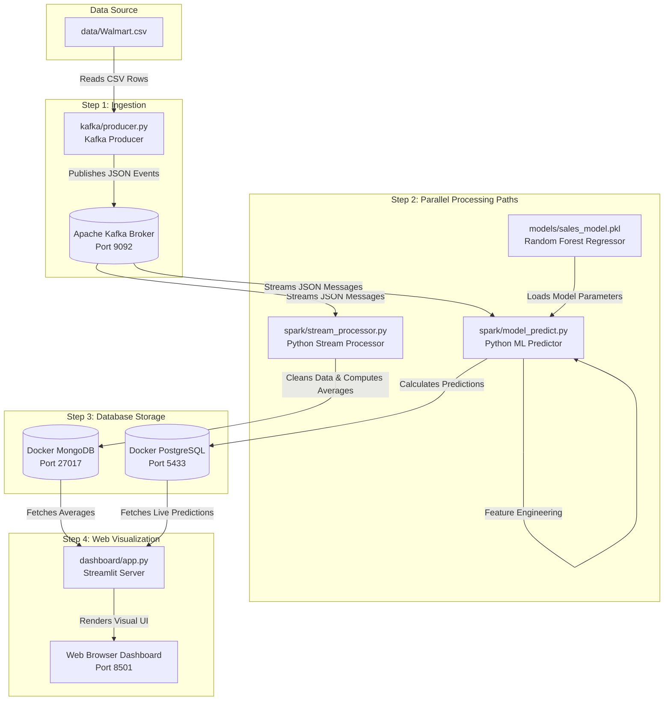

# Walmart Real-Time Sales & ML Predictions Pipeline

This project is a **production-grade real-time sales forecasting and analytical pipeline** built for the Walmart retail dataset. It simulates live transactions, processes them on the fly to compute business metrics, runs machine learning models to forecast future sales, and visualizes everything on a dynamic web dashboard.

---

## 1. What the Project Is

This project is an end-to-end real-time data engineering and machine learning system. In a typical retail environment, transaction logs are generated continuously across thousands of stores and departments. Analyzing this data in batch is slow; this system solves that by treating transactions as a continuous, live event stream. 

The pipeline ingests data, stores real-time aggregations (for business operational monitoring), applies a machine learning model to predict weekly sales in real-time, and exposes both the predicted sales and raw aggregates to users via a frontend dashboard.

---

## 2. The Pipeline We Built

To make this project run reliably on Windows, we built a **Pure Python Real-Time Pipeline** that handles data ingestion, cleaning, stream processing, machine learning inference, and database replication entirely without heavy JVM/Spark dependencies.

Here is a detailed breakdown of the steps in the pipeline:

1. **Simulated Ingestion**: The Kafka Producer reads transaction entries from a CSV, converts them into JSON payloads, and pushes them to a Kafka broker.
2. **Dual-Path Stream Processing**:
   * **Path A (Aggregations)**: Processes the streaming records to continuously calculate average sales metrics by store and by holiday.
   * **Path B (Machine Learning)**: Transforms transaction dates into calendar features (Week, Month, Year) and feeds them to the Random Forest model to calculate predicted sales values.
3. **Multi-Database Storage**: Pushes aggregation results to **MongoDB** and prediction results to **PostgreSQL**.
4. **Reactive Visualization**: A Streamlit dashboard fetches the data from both databases and refreshes every 30 seconds to show live charts.

### Detailed Data Flow & Pipeline Flowchart

The diagram below outlines exactly how data moves through each step in the pipeline, which files process it, and where it is saved:



---

## 3. Technology Stack & What Each Component Generates

Below is a detailed breakdown of the role of each component and what it generates:

### A. Apache Kafka (Message Ingestion)
* **What it is**: A distributed event streaming platform used to ingest and publish data feeds.
* **What it generates**: 
  * It maintains the `walmart-sales` topic.
  * The **Kafka Producer** reads rows from `data/Walmart.csv` at a rate of 2 messages per second, serializes them to JSON payloads, and pushes them to the topic.
  * This simulates a live, continuous feed of transaction events coming from retail cash registers.

### B. Python (Stream Processing Engine)
* **What it is**: Lightweight, native Python processing scripts replacing the heavy, error-prone Windows Spark/Hadoop dependencies.
* **What it generates**:
  * **Stream Processor (`spark/stream_processor.py`)**: Subscribes to the Kafka topic, filters invalid sales records, holds state, computes sliding store-level averages, and pushes these aggregates to MongoDB.
  * **ML Predictor (`spark/model_predict.py`)**: Subscribes to the Kafka topic, parses and formats the dates into feature columns (`Week`, `Month`, `Year`), passes the features to the Scikit-learn model, and generates table-ready predictions for PostgreSQL.

### C. Scikit-learn (Machine Learning Engine)
* **What it is**: An open-source Python ML library.
* **What it generates**:
  * We loaded a pre-trained **Random Forest Regressor** model (`models/sales_model.pkl`).
  * For every transaction message, the model takes 10 parameters (`Store`, `Dept`, `Week`, `Month`, `Year`, `IsHoliday`, `Temperature`, `Fuel_Price`, `CPI`, `Unemployment`) and generates a predicted float value representing the forecasted `Predicted_Sales`.

### D. MongoDB (NoSQL Analytical Storage)
* **What it is**: A document-based NoSQL database running in Docker.
* **What it generates**:
  * **`sales_agg_by_store` collection**: Documents containing the average sales aggregated by store number. Used for high-speed store ranking.
  * **`sales_agg_by_holiday` collection**: Documents showing average sales on holidays vs. non-holidays.
  * **`sales_raw` collection**: Stores the raw JSON payloads for historical backup and stream replication.

### E. PostgreSQL (Relational Transaction Storage)
* **What it is**: A robust relational SQL database running in Docker.
* **What it generates**:
  * Generates the `sales_predictions` table.
  * Pushes highly structured prediction records containing:
    * `store`, `dept`, `date`, `weekly_sales` (actual), `predicted_sales` (ML generated), `variance ($)` (actual - predicted), and environmental conditions.

### G. Streamlit (Real-time Frontend)
* **What it is**: A Python framework for building interactive web apps.
* **What it generates**:
  * **Dynamic KPIs**: Total transactions processed, store counts, average actual vs. predicted sales.
  * **ML Quality KPIs**: Real-time Model Accuracy %, Mean Absolute Error (MAE), Mean Absolute Percentage Error (MAPE), and Total Sales Variance with color indicators.
  * **Interactive Line Charts**: Plotting actual weekly sales and ML predicted sales side-by-side to highlight model deviation.
  * **Aggregated Bar Charts**: Pulled dynamically from MongoDB to show how holidays affect sales and which stores are performing best.
  * **Seasonal & Festive Sales Analysis**: Generates dual-bar charts comparing average actual vs. average predicted sales grouped by Season (Spring, Summer, Autumn, Winter) and specific Festive events (Thanksgiving, Christmas, Super Bowl, Labor Day, and Regular Days).
  * **Granular Table View**: A searchable datagrid of the latest 1,000 predictions allowing the user to filter by store or holiday status.

---

## 4. Summary of Improvements & Troubleshooting Done

During the deployment of this pipeline on your Windows system, we ran into and resolved several environmental bugs:

1. **Eliminated PySpark Windows Compatibility Crashes**: 
   * PySpark has strong dependencies on Windows-native Hadoop binaries (`winutils.exe` and `hadoop.dll`). Missing MSVC redistributable runtimes and JVM permission bugs (like `UnsatisfiedLinkError` on `NativeIO$Windows.access0`) caused the stream to crash.
   * **Solution**: Rewrote the stream processing logic in pure Python using `kafka-python`, `pymongo`, and `psycopg2`. This completely bypassed Java and Hadoop, resulting in a lightweight, stable stream.
2. **Fixed PostgreSQL Port Conflict**:
   * Your system had a local PostgreSQL 18 service running on port `5432` which was blocking the Docker container's PostgreSQL.
   * **Solution**: Reconfigured the Docker container to forward database connections through port `5433`, updating the ML processor and Dashboard credentials to connect successfully.
3. **Corrected Machine Learning Feature Mismatches**:
   * The Random Forest model threw exceptions due to a duplicate `IsHoliday` column created during type conversion.
   * **Solution**: Refactored the DataFrame construction to overwrite the column in-place and guarantee the feature matrix matched the model’s expected order.
4. **Resolved Kafka Offset Gap**:
   * Spark was reading with the `latest` offset, meaning it ignored data sent before the streaming engines started.
   * **Solution**: Configured the consumer groups to read from the `earliest` offset using a unique timestamped group name. The dashboard now populates with historical data instantly.

---

## 5. How to Run the Pipeline

Ensure that Docker is running and you are inside the virtual environment (`venv`).

### Step 1: Start Databases (Docker)
Make sure the containers are up:
```bash
docker-compose up -d
```

### Step 2: Run the Orchestrated Pipeline
We created a launcher script that will automatically run all components (Kafka Producer, Stream Processor, ML Predictor, and Streamlit Dashboard) concurrently:
```bash
python start_pipeline.py
```
Leave this terminal window open.

### Step 3: Open the Dashboard
Open your browser and navigate to:
```url
http://localhost:8501
```
The dashboard will auto-refresh every 30 seconds as live transactions continue to stream into the databases.

---

## 6. Project Summary (Layman's Terms)

Imagine this project as a **live weather forecasting system**, but instead of predicting rain, it predicts **Walmart store sales**.

* **The Raindrops (Data)**: Every transaction receipt printed at a Walmart cash register.
* **The River (Kafka)**: A fast-flowing water channel that carries these receipts instantly across the network so nothing is delayed.
* **The Processors (Water Treatment)**:
  * **Processor A** groups and counts the receipts, immediately telling you simple stats like: *"Which stores are selling the most right now?"* (stored in MongoDB).
  * **Processor B** takes each receipt and runs it by a **smart robot (Machine Learning Model)**. The robot looks at the calendar, holiday status, and temperature, and guesses: *"Here is what I expect this store to sell next week"* (stored in PostgreSQL).
  * **Seasonal & Festive Analyzer** groups the results to answer: *"Do we sell more in Summer or Winter? How do Thanksgiving and Christmas sales compare to normal days?"*
* **The Dashboard (Weather Screen)**: A live-updating screen (Streamlit) that displays beautiful charts so retail managers can instantly check sales, compare seasonal trends, and see how close the robot's guesses are to real life.
